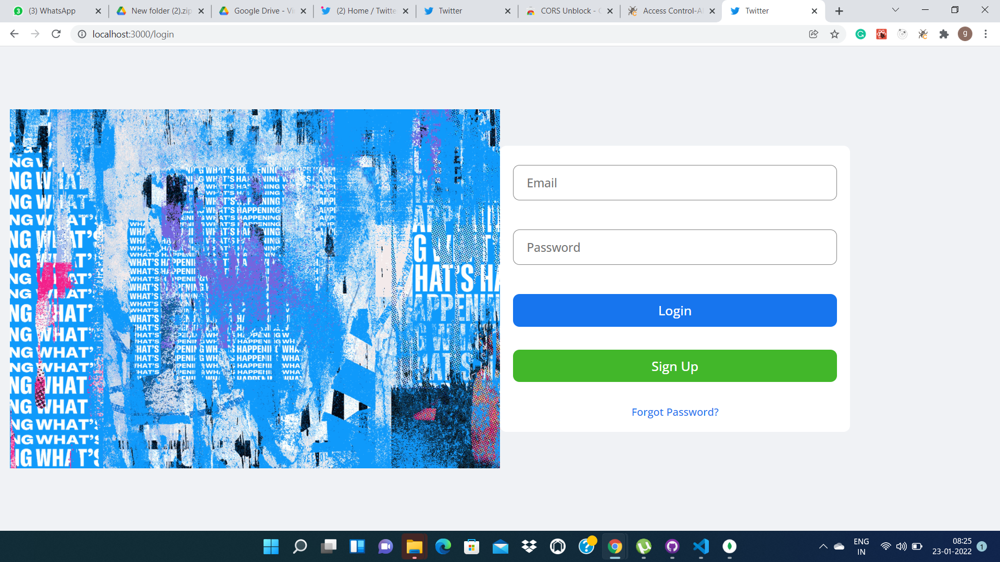
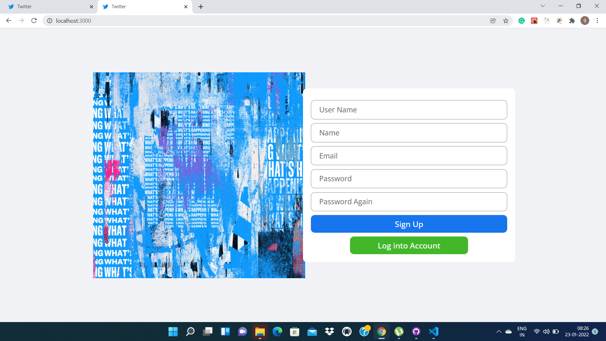
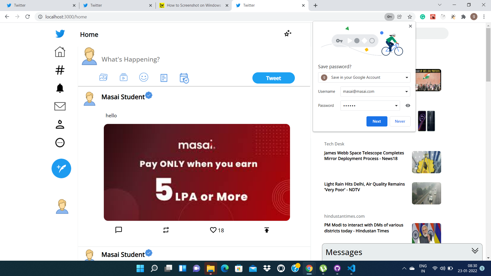
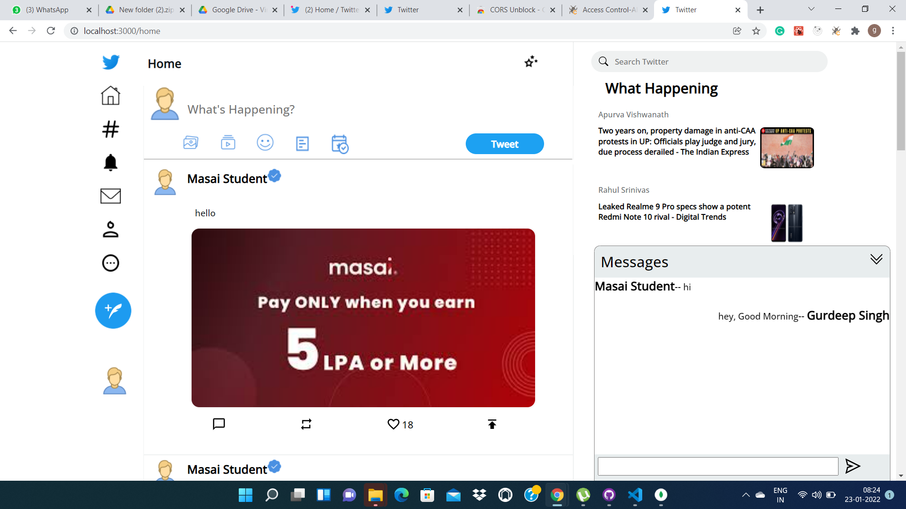
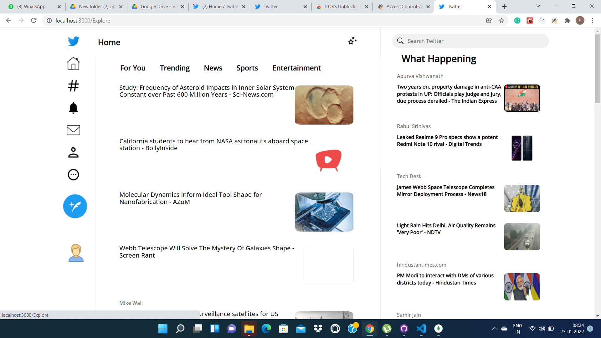

# UpGrad - Clone

>It is a clone of twitter.com. We used HTML, JavaScript, Tailwind CSS, Mongo DB, and Express JS in this Project. We implement features like login, , Sign up, Real time chat and posting a tweet.

## Hosted Platform

## Contributors

1. Gurdeep Singh
2. Sushan Salvi
3. Intezar Khan
4. Abhishek Singh
5. Gaddam Jaswanth

## Technologies Used
> 
> &ensp; 
> &ensp; 
> &ensp; 
> &ensp; 

## Snapshot from the Built Project

>  &emsp;
>  &emsp;
>   &emsp;
>  &emsp;
>  &emsp; 

